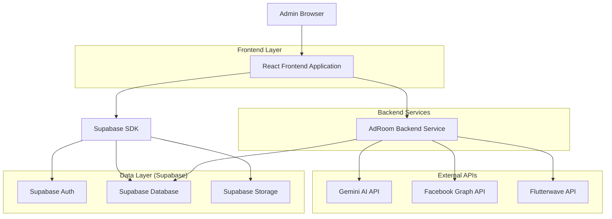
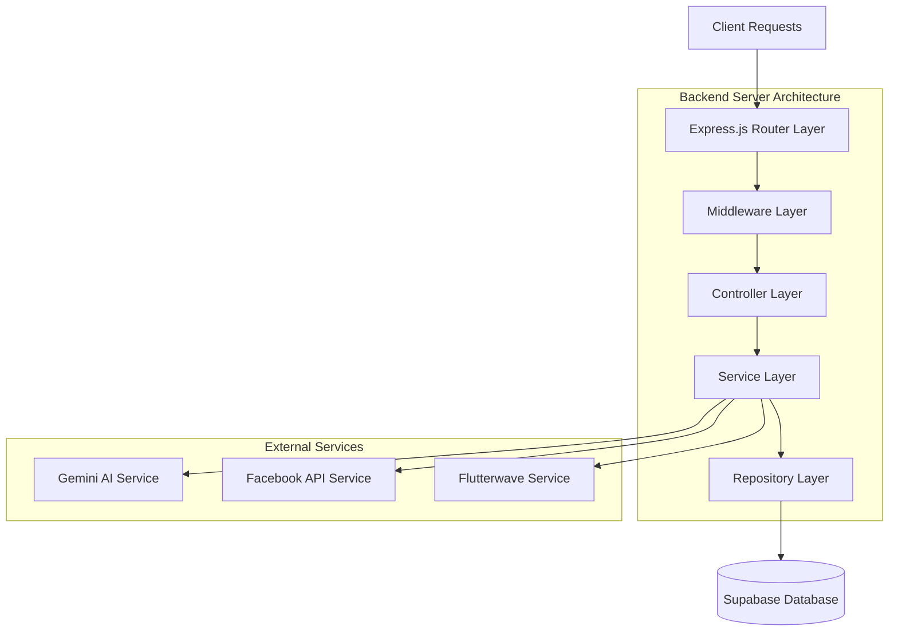
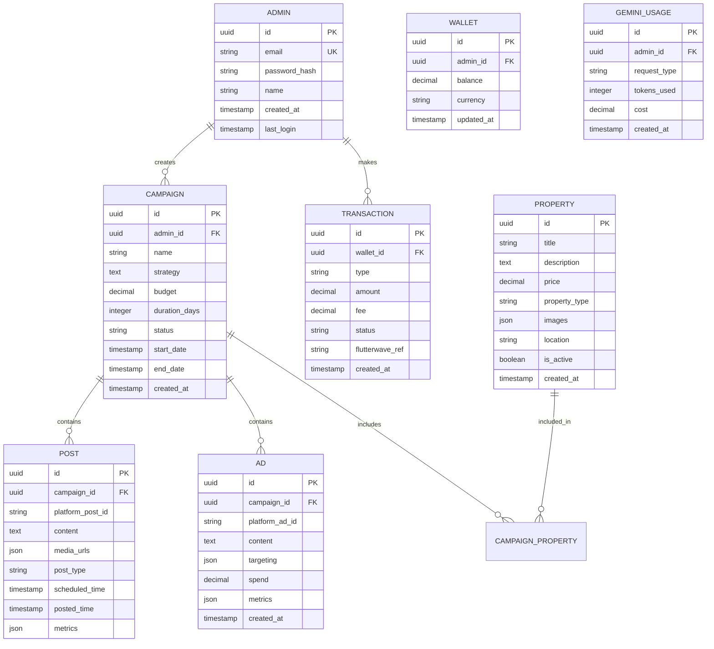

## 1. Architecture design



## 2. Technology Description
- Frontend: React@18 + tailwindcss@3 + vite
- Initialization Tool: vite-init
- Backend: Node.js@18 + Express@4
- Database: Supabase (PostgreSQL)
- Authentication: Supabase Auth
- AI Integration: Google Gemini AI API
- Payment Gateway: Flutterwave API
- Social Media API: Facebook Graph API

## 3. Route definitions
| Route | Purpose |
|-------|---------|
| / | Login page for admin authentication |
| /dashboard | Main dashboard with campaign overview and wallet status |
| /adroom-chat | Conversational interface for strategy planning with AdRoom bot |
| /wallet | Wallet management for deposits and transaction history |
| /analytics | Campaign performance analytics and reporting |
| /properties | Property management interface for uploading and organizing listings |
| /settings | System configuration and API key management |

## 4. API definitions

### 4.1 Authentication APIs
```
POST /api/auth/login
```
Request:
| Param Name | Param Type | isRequired | Description |
|------------|------------|------------|-------------|
| email | string | true | Admin email address |
| password | string | true | Admin password |

Response:
| Param Name | Param Type | Description |
|------------|------------|-------------|
| token | string | JWT authentication token |
| user | object | Admin user details |

### 4.2 Wallet Management APIs
```
POST /api/wallet/deposit
```
Request:
| Param Name | Param Type | isRequired | Description |
|------------|------------|------------|-------------|
| amount | number | true | Deposit amount in NGN |
| payment_method | string | true | Payment method (card, bank_transfer) |

Response:
| Param Name | Param Type | Description |
|------------|------------|-------------|
| transaction_id | string | Flutterwave transaction ID |
| wallet_balance | number | Updated wallet balance |
| fee | number | Transaction fee (45 NGN) |

```
GET /api/wallet/balance
```
Response:
| Param Name | Param Type | Description |
|------------|------------|-------------|
| balance | number | Current wallet balance |
| currency | string | Currency code (NGN) |
| last_updated | timestamp | Last balance update time |

### 4.3 Campaign Management APIs
```
POST /api/campaigns/create
```
Request:
| Param Name | Param Type | isRequired | Description |
|------------|------------|------------|-------------|
| strategy | object | true | Campaign strategy from AdRoom |
| budget | number | true | Total campaign budget |
| duration | number | true | Campaign duration in days |
| properties | array | true | Property IDs to promote |

Response:
| Param Name | Param Type | Description |
|------------|------------|-------------|
| campaign_id | string | Unique campaign identifier |
| status | string | Campaign status (pending, active, completed) |
| estimated_reach | number | Projected audience reach |

```
GET /api/campaigns/{id}/analytics
```
Response:
| Param Name | Param Type | Description |
|------------|------------|-------------|
| reach | number | Total post reach |
| engagement | number | Total engagement count |
| ctr | number | Click-through rate percentage |
| conversions | number | Lead conversions generated |
| spend | number | Total ad spend used |

### 4.4 AdRoom AI APIs
```
POST /api/adroom/strategy
```
Request:
| Param Name | Param Type | isRequired | Description |
|------------|------------|------------|-------------|
| properties | array | true | Property details and images |
| target_audience | object | true | Demographics and interests |
| campaign_goals | string | true | Marketing objectives |

Response:
| Param Name | Param Type | Description |
|------------|------------|-------------|
| strategy_plan | object | Detailed marketing strategy |
| posting_schedule | array | Scheduled post timings |
| ad_recommendations | array | Sponsored ad suggestions |
| budget_breakdown | object | Cost allocation details |

## 5. Server architecture diagram



## 6. Data model

### 6.1 Data model definition


### 6.2 Data Definition Language

Admin Table (admins)
```sql
CREATE TABLE admins (
    id UUID PRIMARY KEY DEFAULT gen_random_uuid(),
    email VARCHAR(255) UNIQUE NOT NULL,
    password_hash VARCHAR(255) NOT NULL,
    name VARCHAR(100) NOT NULL,
    created_at TIMESTAMP WITH TIME ZONE DEFAULT NOW(),
    last_login TIMESTAMP WITH TIME ZONE
);

-- Grant permissions
GRANT SELECT ON admins TO anon;
GRANT ALL PRIVILEGES ON admins TO authenticated;
```

Wallet Table (wallets)
```sql
CREATE TABLE wallets (
    id UUID PRIMARY KEY DEFAULT gen_random_uuid(),
    admin_id UUID REFERENCES admins(id) ON DELETE CASCADE,
    balance DECIMAL(10,2) DEFAULT 0.00,
    currency VARCHAR(3) DEFAULT 'NGN',
    updated_at TIMESTAMP WITH TIME ZONE DEFAULT NOW()
);

-- Grant permissions
GRANT SELECT ON wallets TO anon;
GRANT ALL PRIVILEGES ON wallets TO authenticated;
```

Transactions Table (transactions)
```sql
CREATE TABLE transactions (
    id UUID PRIMARY KEY DEFAULT gen_random_uuid(),
    wallet_id UUID REFERENCES wallets(id) ON DELETE CASCADE,
    type VARCHAR(20) CHECK (type IN ('deposit', 'ad_spend', 'gemini_usage')),
    amount DECIMAL(10,2) NOT NULL,
    fee DECIMAL(10,2) DEFAULT 0.00,
    status VARCHAR(20) DEFAULT 'pending',
    flutterwave_ref VARCHAR(100),
    created_at TIMESTAMP WITH TIME ZONE DEFAULT NOW()
);

-- Create indexes
CREATE INDEX idx_transactions_wallet_id ON transactions(wallet_id);
CREATE INDEX idx_transactions_created_at ON transactions(created_at DESC);

-- Grant permissions
GRANT SELECT ON transactions TO anon;
GRANT ALL PRIVILEGES ON transactions TO authenticated;
```

Campaigns Table (campaigns)
```sql
CREATE TABLE campaigns (
    id UUID PRIMARY KEY DEFAULT gen_random_uuid(),
    admin_id UUID REFERENCES admins(id) ON DELETE CASCADE,
    name VARCHAR(200) NOT NULL,
    strategy TEXT NOT NULL,
    budget DECIMAL(10,2) NOT NULL,
    duration_days INTEGER NOT NULL,
    status VARCHAR(20) DEFAULT 'pending' CHECK (status IN ('pending', 'active', 'paused', 'completed')),
    start_date TIMESTAMP WITH TIME ZONE,
    end_date TIMESTAMP WITH TIME ZONE,
    created_at TIMESTAMP WITH TIME ZONE DEFAULT NOW()
);

-- Create indexes
CREATE INDEX idx_campaigns_admin_id ON campaigns(admin_id);
CREATE INDEX idx_campaigns_status ON campaigns(status);

-- Grant permissions
GRANT SELECT ON campaigns TO anon;
GRANT ALL PRIVILEGES ON campaigns TO authenticated;
```

Properties Table (properties)
```sql
CREATE TABLE properties (
    id UUID PRIMARY KEY DEFAULT gen_random_uuid(),
    title VARCHAR(200) NOT NULL,
    description TEXT,
    price DECIMAL(12,2),
    property_type VARCHAR(50),
    images JSONB,
    location VARCHAR(200),
    is_active BOOLEAN DEFAULT true,
    created_at TIMESTAMP WITH TIME ZONE DEFAULT NOW()
);

-- Grant permissions
GRANT SELECT ON properties TO anon;
GRANT ALL PRIVILEGES ON properties TO authenticated;
```

Posts Table (posts)
```sql
CREATE TABLE posts (
    id UUID PRIMARY KEY DEFAULT gen_random_uuid(),
    campaign_id UUID REFERENCES campaigns(id) ON DELETE CASCADE,
    platform_post_id VARCHAR(100),
    content TEXT NOT NULL,
    media_urls JSONB,
    post_type VARCHAR(20) CHECK (post_type IN ('organic', 'sponsored')),
    scheduled_time TIMESTAMP WITH TIME ZONE,
    posted_time TIMESTAMP WITH TIME ZONE,
    metrics JSONB,
    created_at TIMESTAMP WITH TIME ZONE DEFAULT NOW()
);

-- Create indexes
CREATE INDEX idx_posts_campaign_id ON posts(campaign_id);
CREATE INDEX idx_posts_scheduled_time ON posts(scheduled_time);

-- Grant permissions
GRANT SELECT ON posts TO anon;
GRANT ALL PRIVILEGES ON posts TO authenticated;
```

Gemini Usage Table (gemini_usage)
```sql
CREATE TABLE gemini_usage (
    id UUID PRIMARY KEY DEFAULT gen_random_uuid(),
    admin_id UUID REFERENCES admins(id) ON DELETE CASCADE,
    request_type VARCHAR(50) NOT NULL,
    tokens_used INTEGER NOT NULL,
    cost DECIMAL(10,4) NOT NULL,
    created_at TIMESTAMP WITH TIME ZONE DEFAULT NOW()
);

-- Create indexes
CREATE INDEX idx_gemini_usage_admin_id ON gemini_usage(admin_id);
CREATE INDEX idx_gemini_usage_created_at ON gemini_usage(created_at DESC);

-- Grant permissions
GRANT SELECT ON gemini_usage TO anon;
GRANT ALL PRIVILEGES ON gemini_usage TO authenticated;
```