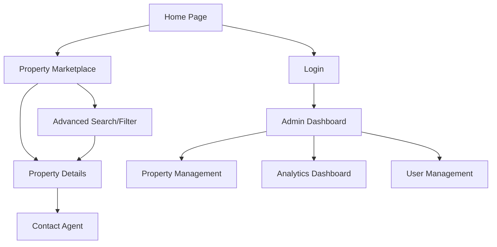

## 1. Product Overview

Villanova Realty is a comprehensive, production-ready real estate platform designed to showcase property listings and provide seamless property management capabilities. The platform serves property buyers, sellers, and real estate agents with an intuitive interface for browsing, managing, and analyzing real estate listings.

The product addresses the need for a modern, scalable real estate website that combines property showcase functionality with robust administrative tools, enabling real estate professionals to efficiently manage their listings while providing an exceptional user experience for property seekers.

## 2. Core Features

### 2.1 User Roles

| Role | Registration Method | Core Permissions |
|------|---------------------|------------------|
| Property Seeker | Email registration | Browse listings, search/filter properties, contact agents |
| Real Estate Agent | Admin invitation/approval | Manage own property listings, view assigned leads |
| Administrator | Manual setup | Full system access, user management, analytics, all property CRUD operations |

### 2.2 Feature Module

Our real estate platform consists of the following main pages:

1. **Home Page**: Hero section with property highlights, animated property slider, company information, and intuitive navigation
2. **Property Marketplace**: All property listings with advanced filtering, detailed property views, interactive maps, and contact functionality
3. **Property Details**: Individual property showcase with image gallery, specifications, location map, and agent contact
4. **Admin Dashboard**: Property management system, analytics dashboard, user management, and image upload functionality
5. **Login/Register**: User authentication and registration system

### 2.3 Page Details

| Page Name | Module Name | Feature description |
|-----------|-------------|---------------------|
| Home Page | Hero Section | Display animated property highlights with smooth transitions, showcase key company information with professional typography |
| Home Page | Property Slider | Auto-rotating carousel of newly added properties with high-resolution images, brief details, and quick view links |
| Home Page | Navigation | Sticky header with clear calls-to-action, responsive mobile menu, property search bar integration |
| Property Marketplace | Property Grid | Responsive grid layout displaying all available properties with thumbnail images, price, location, and key specifications |
| Property Marketplace | Advanced Filters | Multi-criteria filtering by property type, price range, location, size, bedrooms, bathrooms, and special features |
| Property Marketplace | Search Functionality | Real-time search with autocomplete, location-based search with radius selection |
| Property Details | Image Gallery | High-resolution image carousel with zoom functionality, thumbnail navigation, fullscreen view option |
| Property Details | Property Information | Comprehensive property specifications including size, rooms, year built, amenities, and detailed description |
| Property Details | Interactive Map | Embedded map showing exact property location with street view integration and nearby amenities |
| Property Details | Agent Contact | Display assigned agent information with direct messaging, phone contact, and contact form integration |
| Admin Dashboard | Property Management | Complete CRUD operations for property listings with rich text editor, image upload with validation, and bulk operations |
| Admin Dashboard | Analytics Dashboard | Real-time visitor statistics, property view counts, user engagement metrics with interactive charts and export functionality |
| Admin Dashboard | User Management | Role-based user management, agent assignment, permission controls, and activity tracking |
| Admin Dashboard | Image Upload | Drag-and-drop image upload with automatic resizing, format validation, and cloud storage integration |

## 3. Core Process

### Property Seeker Flow
Users can browse the homepage to view featured properties, navigate to the marketplace to search and filter through all available listings, view detailed property information with images and maps, and contact agents directly through integrated messaging systems.

### Agent Flow
Agents can log in to access their dashboard, manage their property listings with full CRUD capabilities, upload and organize property images, view analytics for their listings, and respond to user inquiries.

### Administrator Flow
Administrators have complete system access to manage all properties, users, and system settings, view comprehensive analytics across the platform, and maintain system security and performance.

## 4. User Interface Design

### 4.1 Design Style
- **Primary Colors**: Professional blue (#1E40AF) and white with accent colors of gold (#F59E0B) for premium feel
- **Secondary Colors**: Light gray (#F3F4F6) backgrounds, dark gray (#374151) text
- **Button Style**: Rounded corners with subtle shadows, hover animations, and clear state indicators
- **Font**: Modern sans-serif (Inter or similar) with clear hierarchy: Headers 32-48px, Body 16-18px
- **Layout Style**: Card-based design with generous whitespace, responsive grid systems
- **Icons**: Professional line icons with consistent stroke width, property-specific icons for different listing types

### 4.2 Page Design Overview

| Page Name | Module Name | UI Elements |
|-----------|-------------|-------------|
| Home Page | Hero Section | Full-width background image with gradient overlay, animated text reveal, prominent search bar with location icon |
| Home Page | Property Slider | Card-based carousel with smooth slide transitions, property badges for "New" and "Featured", price tags with currency formatting |
| Property Marketplace | Property Grid | Masonry-style responsive grid, lazy-loading images, hover effects revealing key details, pagination or infinite scroll |
| Property Details | Image Gallery | Full-screen image viewer with zoom controls, thumbnail strip navigation, loading skeletons for optimal performance |
| Property Details | Information Panel | Tabbed interface for different information sections, specification badges, amenity icons with labels |
| Admin Dashboard | Management Panel | Clean data tables with sorting and filtering, modal dialogs for forms, toast notifications for feedback |

### 4.3 Responsiveness
The product is designed with a desktop-first approach, ensuring full functionality on larger screens while maintaining excellent mobile experience. Touch interactions are optimized for mobile devices with appropriate tap targets and swipe gestures for image galleries and property sliders.

### 4.4 Interactive Elements
All interactive elements include smooth animations and transitions. Property cards feature hover effects that reveal additional information, buttons have loading states, and forms provide real-time validation feedback. The design emphasizes user engagement through micro-interactions and visual feedback.