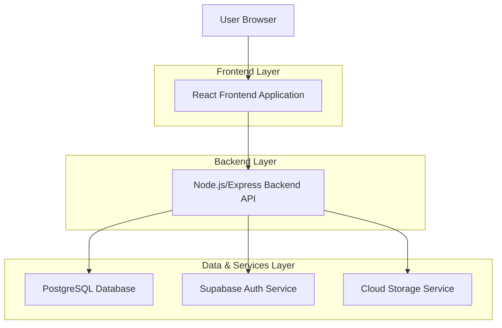
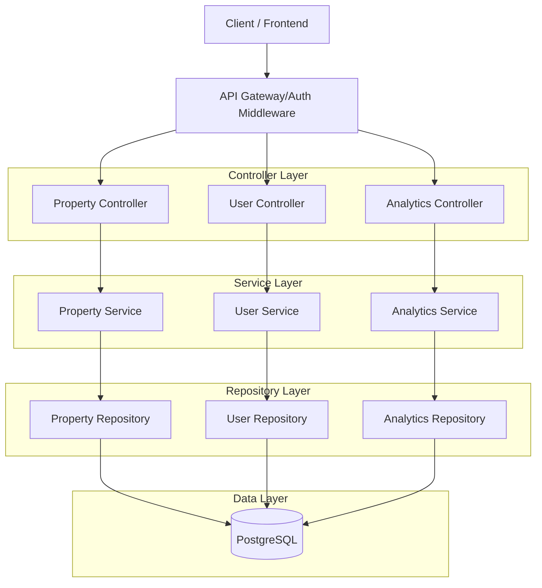
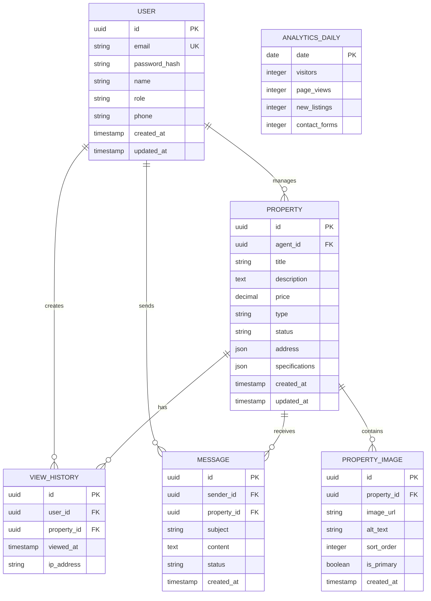

## 1. Architecture Design



## 2. Technology Description

* **Frontend**: React\@18 + Vite + Tailwind CSS\@3 + React Router\@6

* **Initialization Tool**: vite-init

* **Backend**: Node.js\@18 + Express\@4 + Supabase SDK

* **Database**: PostgreSQL (via Supabase)

* **Authentication**: Supabase Auth with JWT tokens

* **File Storage**: Supabase Storage for property images

* **State Management**: React Context + useReducer for complex state

* **HTTP Client**: Axios with interceptors

* **Form Validation**: React Hook Form + Yup

* **Charts/Analytics**: Chart.js or Recharts

* **Maps Integration**: Google Maps API or Mapbox

* **Testing**: Jest + React Testing Library (frontend), Mocha/Chai (backend)

## 3. Route Definitions

| Route             | Purpose                                             |
| ----------------- | --------------------------------------------------- |
| /                 | Home page with hero section and property highlights |
| /properties       | Property marketplace with search and filtering      |
| /properties/:id   | Individual property details page                    |
| /login            | User authentication page                            |
| /register         | User registration page                              |
| /admin            | Admin dashboard with analytics overview             |
| /admin/properties | Property management interface                       |
| /admin/users      | User management interface                           |
| /admin/analytics  | Detailed analytics dashboard                        |
| /profile          | User profile and settings                           |
| /contact          | Contact form for general inquiries                  |

## 4. API Definitions

### 4.1 Authentication APIs

```
POST /api/auth/register
```

Request:

| Param Name | Param Type | isRequired | Description                      |
| ---------- | ---------- | ---------- | -------------------------------- |
| email      | string     | true       | User email address               |
| password   | string     | true       | User password (min 8 characters) |
| name       | string     | true       | Full name                        |
| role       | string     | false      | User role (seeker/agent/admin)   |

Response:

```json
{
  "user": {
    "id": "uuid",
    "email": "user@example.com",
    "name": "John Doe",
    "role": "seeker"
  },
  "token": "jwt_token_string"
}
```

```
POST /api/auth/login
```

Request:

| Param Name | Param Type | isRequired | Description        |
| ---------- | ---------- | ---------- | ------------------ |
| email      | string     | true       | User email address |
| password   | string     | true       | User password      |

### 4.2 Property APIs

```
GET /api/properties
```

Query Parameters:

| Param Name | Param Type | Description                |
| ---------- | ---------- | -------------------------- |
| page       | number     | Page number for pagination |
| limit      | number     | Items per page             |
| type       | string     | Property type filter       |
| min\_price | number     | Minimum price filter       |
| max\_price | number     | Maximum price filter       |
| location   | string     | Location search            |
| bedrooms   | number     | Number of bedrooms         |

```
POST /api/properties
```

Request (Admin/Agent only):

| Param Name     | Param Type | isRequired | Description          |
| -------------- | ---------- | ---------- | -------------------- |
| title          | string     | true       | Property title       |
| description    | string     | true       | Detailed description |
| price          | number     | true       | Property price       |
| type           | string     | true       | Property type        |
| address        | object     | true       | Address details      |
| images         | array      | true       | Array of image URLs  |
| specifications | object     | true       | Property specs       |

### 4.3 Analytics APIs

```
GET /api/analytics/dashboard
```

Response:

```json
{
  "totalProperties": 150,
  "totalViews": 12500,
  "totalUsers": 850,
  "dailyStats": {
    "visitors": 245,
    "pageViews": 1200,
    "newListings": 5
  },
  "topProperties": [...],
  "userEngagement": {...}
}
```

## 5. Server Architecture Diagram



## 6. Data Model

### 6.1 Data Model Definition



### 6.2 Data Definition Language

**Users Table**

```sql
CREATE TABLE users (
    id UUID PRIMARY KEY DEFAULT gen_random_uuid(),
    email VARCHAR(255) UNIQUE NOT NULL,
    password_hash VARCHAR(255) NOT NULL,
    name VARCHAR(100) NOT NULL,
    role VARCHAR(20) DEFAULT 'seeker' CHECK (role IN ('seeker', 'agent', 'admin')),
    phone VARCHAR(20),
    created_at TIMESTAMP WITH TIME ZONE DEFAULT NOW(),
    updated_at TIMESTAMP WITH TIME ZONE DEFAULT NOW()
);

CREATE INDEX idx_users_email ON users(email);
CREATE INDEX idx_users_role ON users(role);
```

**Properties Table**

```sql
CREATE TABLE properties (
    id UUID PRIMARY KEY DEFAULT gen_random_uuid(),
    agent_id UUID REFERENCES users(id) ON DELETE CASCADE,
    title VARCHAR(255) NOT NULL,
    description TEXT NOT NULL,
    price DECIMAL(12,2) NOT NULL,
    type VARCHAR(50) NOT NULL CHECK (type IN ('house', 'apartment', 'condo', 'townhouse', 'commercial')),
    status VARCHAR(20) DEFAULT 'available' CHECK (status IN ('available', 'sold', 'pending', 'withdrawn')),
    address JSONB NOT NULL,
    specifications JSONB NOT NULL,
    view_count INTEGER DEFAULT 0,
    created_at TIMESTAMP WITH TIME ZONE DEFAULT NOW(),
    updated_at TIMESTAMP WITH TIME ZONE DEFAULT NOW()
);

CREATE INDEX idx_properties_agent ON properties(agent_id);
CREATE INDEX idx_properties_type ON properties(type);
CREATE INDEX idx_properties_price ON properties(price);
CREATE INDEX idx_properties_status ON properties(status);
```

**Property Images Table**

```sql
CREATE TABLE property_images (
    id UUID PRIMARY KEY DEFAULT gen_random_uuid(),
    property_id UUID REFERENCES properties(id) ON DELETE CASCADE,
    image_url VARCHAR(500) NOT NULL,
    alt_text VARCHAR(255),
    sort_order INTEGER DEFAULT 0,
    is_primary BOOLEAN DEFAULT false,
    created_at TIMESTAMP WITH TIME ZONE DEFAULT NOW()
);

CREATE INDEX idx_images_property ON property_images(property_id);
CREATE INDEX idx_images_primary ON property_images(is_primary);
```

**View History Table**

```sql
CREATE TABLE view_history (
    id UUID PRIMARY KEY DEFAULT gen_random_uuid(),
    user_id UUID REFERENCES users(id) ON DELETE CASCADE,
    property_id UUID REFERENCES properties(id) ON DELETE CASCADE,
    viewed_at TIMESTAMP WITH TIME ZONE DEFAULT NOW(),
    ip_address INET
);

CREATE INDEX idx_view_history_user ON view_history(user_id);
CREATE INDEX idx_view_history_property ON view_history(property_id);
CREATE INDEX idx_view_history_date ON view_history(viewed_at);
```

### 6.3 Security Implementation

**Row Level Security (RLS) Policies**

```sql
-- Properties table security
ALTER TABLE properties ENABLE ROW LEVEL SECURITY;

-- Allow all users to view active properties
CREATE POLICY "View active properties" ON properties
    FOR SELECT
    USING (status = 'available');

-- Allow agents to manage their own properties
CREATE POLICY "Agents manage own properties" ON properties
    FOR ALL
    USING (agent_id = auth.uid());

-- Allow admins to manage all properties
CREATE POLICY "Admins manage all properties" ON properties
    FOR ALL
    USING (EXISTS (
        SELECT 1 FROM users 
        WHERE id = auth.uid() AND role = 'admin'
    ));
```

**Supabase Role Permissions**

```sql
-- Grant basic read access to anon role
GRANT SELECT ON properties TO anon;
GRANT SELECT ON property_images TO anon;
GRANT SELECT ON users TO anon;

-- Grant full access to authenticated role
GRANT ALL PRIVILEGES ON ALL TABLES IN SCHEMA public TO authenticated;
GRANT ALL PRIVILEGES ON ALL SEQUENCES IN SCHEMA public TO authenticated;
```

### 6.4 Performance Optimization

**Database Indexes for Common Queries**

```sql
-- Composite index for property search
CREATE INDEX idx_properties_search ON properties(type, price, status);

-- Index for location-based queries (if using PostGIS)
-- CREATE INDEX idx_properties_location ON properties USING GIST (location);

-- Index for analytics queries
CREATE INDEX idx_view_history_daily ON view_history(DATE(viewed_at));
```

### 6.5 Backup and Recovery Procedures

**Automated Backup Configuration**

* Daily automated backups via Supabase

* Point-in-time recovery capability

* Cross-region backup replication

* Monthly backup testing and validation

**Data Retention Policies**

* Property images: Retain for 1 year after property withdrawal

* User data: Retain for legal compliance period

* Analytics data: Aggregate and archive after 2 years

